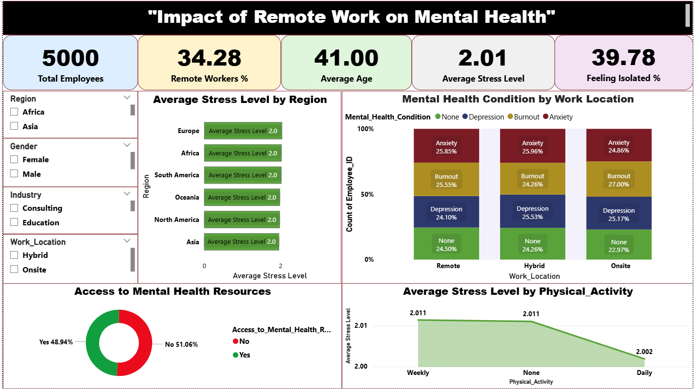

# Impact of Remote Work on Mental Health

This Power BI dashboard analyzes the impact of remote work on employees' mental health. It highlights key metrics such as:

- Total employees  
- Percentage of remote workers  
- Average age  
- Average stress level  
- Feeling of isolation (%)  
- Mental health condition by work location  
- Stress level by physical activity  
- Access to mental health resources  

## Tools Used
- Microsoft Power BI  
- DAX  
- Data visualization techniques  

## Purpose
To help organizations understand how remote and hybrid work settings affect mental well-being and guide decisions on workplace mental health support.
